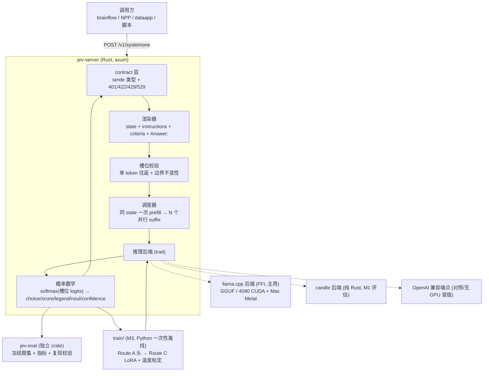

# jev-clone — 设计文档（v0.1，待认可）

> 2026-09-19 ｜ 状态：**设计待评审，未写实现代码**（遵循「先研究蓝本源码 → 画图证明理解 → 获认可后才开发」）
> 蓝本源码已在本地逐行读过：见 [blueprints.md](blueprints.md)（三份开源复现 + 官方契约）
> 定位：**本地、契约兼容、零生成、带概率的决策服务**。独立实现，与 TypeSafe 无关。

---

## 0. 判词：我们要复刻的不是"更小的 LLM"，而是**"把不确定性做成可编程接口"**

官方原话把话说得很清楚：

> "While Jev gives up string generation, it's optimized for structured outputs and can't hallucinate."
> —— 但同时 docs 自陈 `"Our number is not empirical. Schema matching is guaranteed, thus we can confidently add 0% into the plots."`，并在 jaggedness 页列出 9 类失败模式。

所以本项目的**正确目标**是：给定 `state`（任意文本/JSON）+ 一组**运行时定义**的 typed question，**一次前向**返回该问题的概率分布，让调用方的代码去阈值/加权/分支。契约里必须写死的一句话是：

> **我们保证"不会输出选项外的值"，我们不承诺"答案是对的"。**

这句定位决定了整个项目的第一指标不是 accuracy，而是**校准（calibration）**。

---

## 1. 为什么值得做：三份蓝本把"接口"开源了，"校准"留白了

三份公开复现在 72 小时内都复刻了同一个东西——**接口形状**（state + 运行时 criteria → 一次前向 → 每个选项一个分数）。SemIf 自己在 `docs/RESULTS.md` 的 "Not reproduced or established" 里明确列了没做到的事：

1. Jev 未公开的架构 / 并行采样器；
2. **RLCD 训练**（训练数据与算法说明都不公开）；
3. **可用于生产阈值的校准概率**（"Calibrated probabilities suitable for operational thresholds"）；
4. Terra/frontier 级通用语义能力；
5. 等效负载/服务栈上的官方延迟与成本数字。

**这就是我们的空档**：接口既然已经开源，项目价值就不该重复第四次"接口复刻"，而应该做那三件没人做的事——**校准、中文、把前缀复用写进架构**。

| 差异化 | 为什么是它 | 验收信号 |
|---|---|---|
| **校准优先** | 蓝本都只报 accuracy/agreement；官方 confidence 公式未公开（只说"derived from probabilities"），open-jev 用 `1 - H/log n` 近似 | 中文题集上 **ECE ≤ 0.05**、Brier 优于温度标定前，并给出可靠性曲线 |
| **中文优先** | 官方明确：英文是唯一主训练语言，CJK「能处理但效果不等」并要求自测 | 自建中文题集（≥150 行）平衡准确率与 ECE 双报，且与英文对照集分开 |
| **前缀复用即架构** | SemIf 实测：同 state 的 21 个判断，fresh 8.99 s → 一次 prefill + 并行 suffix 1.05 s（**2.33 → 20.03 判断/秒**） | 同 state N 问题 **≥3×** 于逐问题重编码；写进 M1 硬指标 |
| **可嵌入** | 契约是给代码用的，不是给人看的：brainflow/NPP 的结构化问题契约（`pick_one/pick_many/confirm/ask_text`）可以插拔"回答者" | 一个 HTTP 契约 + 一个库 API，能被画布/工作流当"机器回答者"调用 |

---

## 2. 架构

**关键设计点（都是从蓝本里学来的，不是猜的）**

1. **槽位必须是单 token 且边界稳定**。SemIf 的 `direct.py` 用两条断言把这件事钉死：字母槽位 `A..` 必须"编码-解码往返唯一"（`_slot_ids`），且 `tokenize(prompt + letter) == tokenize(prompt) + [slot_token]`（`encode_prompt`）。**中文/数字槽位必须重做这套校验**——这是 M0 的第一件事，也是蓝本里最容易踩碎的细节。
2. **不截断**。SemIf 对超长直接抛错。我们也抛，并返回官方风格的 `422`（官方 32k 是 state 与问题共享的预算）。
3. **回答独立性**（官方明文）：同一请求内各问题互不影响。这允许我们做**推测式扇出**（把可能用不上的问题也一起问，几乎免费），也意味着**不能**让问题 A 的答案进问题 B 的 prompt。
4. **confidence 要"多实现可切换"**。官方不公开公式；open-jev 的 `1 - H/log n` 只是近似。我们先实现三种（归一化熵、top1 间隔、top1 概率），**用 ECE 选**，并把选中的那个当默认——这比抄一个近似更有意义。
5. **前缀复用是一等公民**：同 state 的 N 个问题共享 KV 前缀，suffix 并行。这是 SemIf 用 8.6× 的实测证明过的收益点。

---

## 3. 契约对照（我们要实现的字段级兼容面）

| 项 | 官方（docs.typesafe.ai） | 我们 M0 实现 |
|---|---|---|
| 端点 | `POST /v1/systemone` | 同 |
| 鉴权 | `Authorization: Bearer` | 同（本地可关） |
| `state` | `string \| object \| array`（必填） | 同；对象/数组按 `json.dumps(indent=2)` 渲染进 prompt |
| `model` | 必填，如 `jev-latest` | 同字段；值是我们自己的模型名（`local-latest` 等），**不改字段名** |
| `questions` | `map<id, Question>`，id 不入推理 | 同（id 只用于回填答案） |
| `choice` | `criteria: map<string, string\|null>`，≥2，≤255；返回 `choice`/`probabilities`/`confidence` | 同（`MAX_CHOICE_OPTIONS = 255`） |
| `score` | `criteria: array`（≥2 有序档）；返回 `score`/`legend`/`probabilities`/`confidence`，`score` 可为小数 | 同，`score = Σ i·pᵢ` |
| `noul` | 可选 `criteria.{true,false}`；返回 `noul`(0..1)，**无 confidence** | 同，`noul = p(yes)` |
| `usage` | `{input_tokens, output_tokens}` | 同（我们 `output_tokens` 恒为 0 或槽位数，如实标注） |
| 错误码 | 401 / 422 / 429 / 529 | 同（本地默认不限流，可开） |
| 语义约束 | 答案被**约束在选项集合内**；问题之间**独立** | 同，且写进 README 的诚实声明 |

> 与官方**不同**的地方（必须写进 README，不许含糊）：模型不是 Jev、不保证同分布、不承诺官方延迟/成本；`confidence` 是我们自选的定义。

---

## 4. 里程碑（每步都有可验证产物）

**M0 — 契约与骨架（无 GPU 也能跑通）**
- `crates/jev-core`：契约类型（serde）、渲染器、**槽位校验**、概率数学、confidence 三实现。
- `crates/jev-backend`：`trait DecisionBackend`（一次前向返回"给定 token id 的 logits"）；先实现 **OpenAI 兼容端点后端**做冒烟（零 GPU），再 llama.cpp。
- `crates/jev-server`：axum，`/v1/systemone` + `/healthz`。
- 验收：官方文档里的 4 个示例请求**字段级对齐**（结构、类型、取值范围；`Σp = 1 ± 1e-6`；`choice = argmax`）；单元测试覆盖槽位校验的失败路径（多 token 槽位、边界改变 tokenization、超长）。

**M1 — 真模型 + 前缀复用（性能是硬指标）**
- llama.cpp 后端（FFI）接 GGUF；同 state 前缀共享 + suffix 并行批处理。
- 验收：同 state 21 问题的 **判断/秒 ≥ 3×** 于逐问题重编码（基线对齐 SemIf 的 2.33 → 20.03）；在 4090 与 M3 Ultra 各出一张基准表；报告 p50 延迟与峰值显存。

**M2 — 冻结评测（可复现，不掺水）**
- `crates/jev-eval`：题集冻结（内容 hash 写进 manifest）、指标冻结、结果落盘 + **复现校验脚本**（照 SemIf 的 `verify_published.py` 做法：报告里每个数字都能被原始结果文件重算出来）。
- 题集：**中文自建 ≥150 行**（证据判断/规则应用/候选选择/缺失证据）+ 英文对照（WANLI 之类公开集）+ 若能取到 TypeSafe 公开评测快照则做 102 行对齐（**只作参考分布对齐，不当 ground truth**）。
- 指标：平衡准确率 / NLL / Brier / **ECE + 可靠性曲线**；扰动三件套（选项顺序反转、标准措辞包裹、追加无关上下文）；缺失证据题（是否敢选"信息不足"）；全部按源分层上报，**禁止合并成一个总分**。
- 验收：一条命令重跑出与提交结果逐位一致的数字。

**M3 — 训练与校准（走蓝本验证过的路线，不冒进）**
- Route A：冻结编码器 + attention head（`jevlike` 已验证：head 是唯一被梯度碰的东西）。
- Route C：LoRA 微调（编码器 lr 比 head 低一个数量级 + warmup）。
- **新增**：温度标定 / 校准损失，用 M2 的中文题集验收（目标 ECE ≤ 0.05 且 accuracy 不掉）。
- 数据：自建 + 公开 NLI（中文 C3/OCNLI 类）+ 教师蒸馏（记录教师与一致率）。

**M4 — 可选：契约桥**
- 把服务暴露成 brainflow/NPP 的"机器回答者"（`answerer: auto|human` + 置信度阈值），低置信度升级问人。

---

## 5. 技术选型（已查过 crates.io / 现有资产）

| 面 | 选型 | 依据 |
|---|---|---|
| 语言 | **Rust**（workspace：core/backend/server/eval） | 项目铁律：纯 Rust，不引 Python 运行时；发布零 node |
| HTTP | `axum` + `serde`/`serde_json` | 生态标准，契约层纯类型 |
| 推理主后端 | **llama.cpp FFI** | 模型无关、GGUF 到处能跑；4090 与 Mac 都在用；用户既有生态熟 |
| 推理备选 | `candle-transformers 0.11.0`（crates.io 已确认存在） | 纯 Rust；模型覆盖需在 M1 逐项核对（**未验证项**） |
| 训练（M3） | Python + PyTorch，**一次性离线脚本放 `train/`，不进产品线** | 训练无法纯 Rust；与"产品运行时不引 Python"不冲突（需你确认这条边界） |
| 现成权重 | 115 已有 `Qwen3-0.6B` / `Qwen3-1.7B-Instruct` / `gemma-4-26B-A4B-it` / `Qwen3.8-27B` | M0/M1 用 1.7B 冒烟，4B 级（Qwen3.5-4B 等）按需下载 |

---

## 6. 明确不做（诚实清单）

- 不训练大模型从零；不与 frontier 模型比通用能力。
- **不宣称"不能幻觉"**——只说"输出被约束在给定选项集合内"。
- 不把 TypeSafe 公开评测当 ground truth（那是"两个最强模型的平均"，官方自己承认偏向 OpenAI/Anthropic）；不跑真 Jev endpoint 的替代品冒充对照。
- 不把 accuracy 当唯一指标，不跨源合并分数。
- 不追官方未公开的架构（无论文无模型卡，任何"参数量/结构"都是推测）。

---

## 7. 风险与对策

| 风险 | 对策 |
|---|---|
| 中文 tokenizer 下"选项槽位单 token"不成立 | M0 第一件事就是跨 tokenizer 的槽位校验器；不成立时改用"多 token 槽位 + 前缀共享"的精确 logprob 求和 |
| 官方契约随版本变化（1.13 → …） | 契约版本化，只实现公开字段；存一份 snapshot 作为对照 fixture |
| llama.cpp FFI 与 Rust 生命周期/线程安全 | 后端 trait 隔离 + 单进程内串行调度；candle 后端作为纯 Rust 退路 |
| 校准缺标注 | M3 前先定"操作级校准目标"（哪个阈值、什么代价），再用教师蒸馏补量 |
| 自建题集"自己出题自己考" | 冻结 + 内容 hash + 第三方可复算的复现脚本；报告里显著标注题集来源与规模 |

---

## 8. 待你拍板的三件事

1. **训练语言边界**：`train/` 用 Python 一次性离线脚本（推荐），还是必须纯 Rust？
2. **M0 的模型**：先用 115 上现成的 `Qwen3-1.7B-Instruct` 冒烟（最省事），还是直接下 `Qwen3.5-4B`（对齐 SemIf 的对照基线）？
3. **仓库名**：现用 `alitrack/jev-clone` 是否合适（一句话即可改名）。
