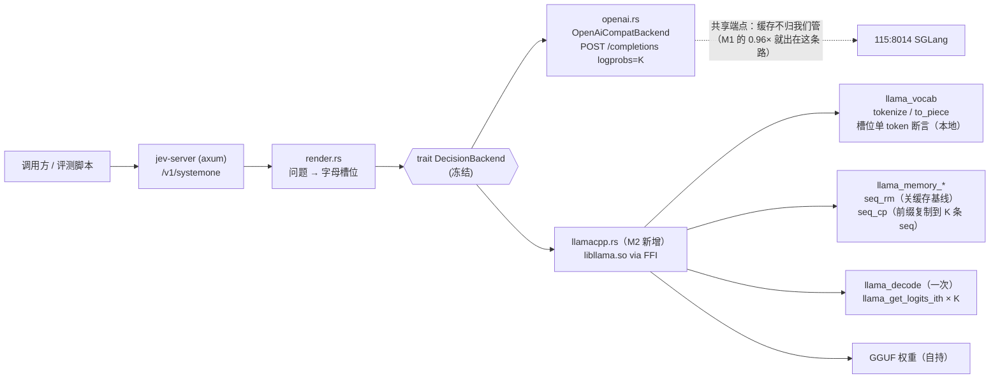

# M2 规格 —— llama.cpp 自持后端（FFI）+ 在自有后端上重测前缀复用门
> 2026-09-20 ｜ 依据：`refs/llama.cpp`（llama.cpp **b10472** 源码副本）+ 115/Mac 实测环境
> 上游依据：`docs/design.md` §4 M1 行、`specs/M1.md` §4.1（≥3× 门未达标的三条原因与重述）
> ⛔ 本文件是**提案**。按项目铁律，**未获认可不写实现代码**。

> ## ⛔ 2026-09-20 项目定位复审：**本规格停做，未实施**
>
> 复审结论：M2 解决的是「**自持后端 + 前缀复用**」，而这一层在 2026-09-17→09-20 的 72 小时内已被生态占满，
> 且**官方自己**发布了 `typesafe-ai/system-one-adapter-python`（165★，*"A drop-in replacement for `typesafe_sdk`'s
> `system_one` evaluation API, backed by LLM [APIs]"*，`OpenAIProvider(model, base_url=...)` 可指向任意
> OpenAI 兼容端点）——即「用别的 LLM 冒充 System One」是官方铺的路，不是缺口。
> 前缀复用本身是 SGLang radix cache / vLLM APC / llama.cpp prompt cache 的常规能力，
> `ekzhang/openjev-sglang`（194★，prefill-only 的 Jev 兼容端点）已把这条实现路线走完。
> ⇒ **M2 降级为「自用测量器」，不作为产品路线继续**；本规格**保留**（§1–§7 的取证与实测数字仍然有效、
> 可被引用），但**不再实施**、不再投 GPU。完整依据见 §9 与
> `raw/articles/research/jev-typesafe-system-one-20260919.md` §12/§13。
>
> 实施状态（供审计）：**Rust 侧一行实现代码都没有写**；仓内**无任何 M2 痕迹**（2026-09-20 处置后）。
> 当时唯一多出的未跟踪文件 `crates/jev-backend/src/llamacpp/shim.c`（C shim，避免 Rust 镜像版本相关的
> 结构体布局）在 M2 停做后**已移出仓**，存于 `/mnt/d/wsl2/tmp/jev-m2/archive/shim.c`
> （sha256 `20db8708…8213`，198 行；与仓外的 link 用 sysroot `/mnt/d/wsl2/tmp/jev-m2/sysroot/{lib,include}` 同处归档）。
> 移出的理由：全仓无任何引用（无 `build.rs` / `Cargo.toml` / 代码引用），而本规格自述「Rust 侧一行实现代码都没有写」——
> 让一个未跟踪的 C 文件杵在源码树里会使这句话与仓库实际状态不符（审计误导）。**技术结论留在本节与 §9，代码本体不在仓内。**

---

## 0. 不变量（M2 不许破坏的东西）

1. **`trait DecisionBackend` 冻结**（`crates/jev-backend/src/lib.rs:95-126`）：`token_logprobs` /
   `token_logprobs_batch` / `model_name` 三件不变；自持后端是**新增实现**，不是改 trait。
2. **`Readout` 形状不变**（`lib.rs:55-60`）：`top: BTreeMap<String, f64>` = **token 文本 → logprob**。
   ⚠️ 自持后端必须把 token id **反查成文本**（`llama_token_to_piece`），key 口径要与现有 OpenAI 后端一致
   （含前导空格变体 `" A"` vs `"A"`）——`Readout::slot_logprob`（`lib.rs:70-90`）靠 trim + log-sum-exp 吸收这两种拼写。
3. **数值与契约不变量不变**：`Σp = 1 ± 1e-6`、`choice = argmax(probabilities)`、`score.legend` 为档位描述文本。
4. **HTTP 面不变**：`/v1/systemone`、`/healthz` 的字段与错误码（422 槽位缺失 / 502 后端故障）不变。
5. **零 GPU 也能测**：无 llama.cpp 运行时的机器上，`cargo test --offline` 仍须全绿（新后端 **feature-gated**）。
6. M0/M1 已有测试与冻结缺陷**不改**（`specs/M1.md` §5.4：冻结接口的缺陷只报告不改）。

---

## 1. 环境事实（2026-09-20 实测，本规格的依据）

| 项 | 实测 |
|---|---|
| 115 GPU | `0: 18 MiB / 0%`（**空闲**）、`1: 43.9 GB / 100%`、`2: 43.5 GB / 100%`、`3: 25.4 GB / 0%`（各 49 GB） |
| 115 端点 | `8014` = SGLang 0.5.19，`Qwen3.8-27B-FP8`，`--tp-size 2`，`--context-length 262144`，`--speculative-algorithm DFLASH`；`8017` = NInfer（**拒 logprobs，不可做读出头**，M0 已复现两次） |
| 115 上的 GGUF | `/home/home/lhy/llm/models/gguf/`：`Qwen3.8-27B-Q4_K_M.gguf`（17.1 GB）、`Qwen3.8-27B-NVFP4-MTP-HIGHEST.gguf`（23.2 GB）、`mmproj-BF16.gguf`（0.93 GB）；**无小模型 GGUF** |
| 115 上的 llama.cpp | 运行时 `bin/cuda/`：`libllama.so.0.2.0`（→ `libllama.so.0`，4.6 MB）+ `libggml-base/cpu/cuda/rpc.so.0.21.0`；源码 `/home/home/lhy/llm/engines/llama.cpp-b10472`（本机副本 = `refs/llama.cpp`，**无 `.git`**，无法就地比对提交）；**当前没有任何 llama.cpp 服务在跑** |
| 该 `.so` 的可用性（2026-09-20 实测，只读探针） | `nm -D --defined-only libllama.so.0.2.0`：**5275 个导出符号，M2 需要的 24 个符号 0 缺失**（`llama_model_load_from_file`…`llama_perf_context` 全在） |
| 该 `.so` 的版本自证 | `ggml_version() = 0.21.0`、`ggml_commit() = d8f26eec7`；⚠️ `llama_print_system_info()` 的输出里**没有 `build: bNNNN` tag**（本构建格式如此）⇒ 版本只能用 `ggml_version/ggml_commit`（`ggml.h:727-728`）核对 |
| ⚠️ **头文件与 `.so` 不同源（实测发现）** | 115 源码树是 tag `b10472` = 提交 `60eeeb60`，而 `.so` 自报 `d8f26eec7`（2026-09-09）——**两个不同提交**。两者 `include/llama.h` 差 13 行，其中 `llama_context_params` **多出 `path_kv_mean_center` 字段（结构体布局变了）** ⇒ 用 b10472 的表头去调 d8f26eec7 的库是**真 ABI 风险**。处置：已按 `.so` 自报的提交 `d8f26eec7` 拉取源码（`refs/llama-d8f-src/`），**FFI 一律以该表头为准**；后续若自行构建则锁同一提交 |
| 离线 crates 缓存 | `bindgen` 0.66.1/0.71.1/0.72.1、`cc` 1.0.79→1.4.3 均已在 `~/.cargo/registry/cache`；`libclang`：WSL `/usr/lib/llvm-19/`、115 `/usr/lib/llvm-18/` 都在 ⇒ bindgen 路线**有料可走** |
| 共享端点被抢占的证据 | 同一 trivial 请求（`max_tokens=4`）：无人抢时 **0.43 s**；被本会话 3 个 worker 并发打满时 **14.2 s** ⇒ sigil 硬编码的 120 s 流空闲超时当场把 worker 打死 |
| Mac | `sa@10.10.10.100`：`llama-server 127.0.0.1:8080`（Bonsai 27B，Mac 本机） |

**⇒ 为什么必须做自持后端**：`specs/M1.md` §4.1 已定 —— 在「服务端自带 radix 缓存、客户端无法关闭」的端点上，
≥3× 门**不可测**（实测 0.96×，基线被服务端缓存救过）。只有自持后端里 KV cache 归我们管，
「逐问题重编码」基线才真实存在。

---

## 2. 架构（M2 落在哪一层）



---

## 3. M2-1 llama.cpp 后端（FFI）

### 3.1 必需的 C API 最小面（全部来自 `refs/llama.cpp/include/llama.h`，逐条 file:line）

| 动作 | 调用 | 位置 |
|---|---|---|
| 加载模型 | `llama_model_load_from_file(path, params)`（旧名 `llama_load_model_from_file` 已 `DEPRECATED`） | `:507`（旧名 `:499`） |
| 建 context | `llama_init_from_model(model, params)`（旧名 `llama_new_context_with_model` 已废弃） | `:532` |
| 取词表 | `llama_model_get_vocab(model)` → `llama_vocab_n_tokens(vocab)` | `:576` / `:601` |
| 分词 | `llama_tokenize(vocab, text, len, tokens, n_tokens_max, add_special, parse_special)` | `:1163` |
| id→文本 | `llama_token_to_piece(vocab, token, buf, len, lstrip, special)` | `:1177` |
| 批 | `llama_batch_init(n_tokens, embd, n_seq_max)` / `llama_batch_free(batch)` | `:951` / `:957` |
| 解码 | `llama_decode(ctx, batch)`（返回 1 = KV 槽不够；2 = 被 abort） | `:981` |
| 读 logits | `llama_get_logits_ith(ctx, i)`；语义：**只为 `batch.logits[i] != 0` 的条目输出**，按 batch 顺序连续存放，`行数 × n_vocab` | `:1043`（语义 `:1031-1036`） |
| ⚠️ `logits_ith` 的 `i` 是**batch 下标** | 不是「输出列表里的序号」。传输出序号会直接报 `get_logits_ith: invalid logits id 0, reason: batch.logits[0] != true`（2026-09-20 实测踩到，已在 spike 里改成记录每个末尾 token 的 batch 下标） | 实测（`spike/jev_m2_spike.c`） |
| KV 记忆体 | `llama_get_memory(ctx)` | `:573` |
| 关缓存基线 | `llama_memory_seq_rm(mem, seq_id, p0, p1)`（`p0=p1=-1` = 清空整条 seq；**删整条 seq 不会失败**） | `:739` |
| 前缀复制 | `llama_memory_seq_cp(mem, src, dst, p0, p1)` | `:748` |
| 只留一条 | `llama_memory_seq_keep(mem, seq_id)` | `:756` |
| 记忆体自检 | `llama_memory_seq_pos_min/max(mem, seq_id)`（空 seq 返回 -1） | `:784` / `:791` |
| 线程 | `llama_set_n_threads(ctx, n_threads, n_threads_batch)` | `:988` |
| 释放 | `llama_free(ctx)` / `llama_model_free(model)` | `:542` / `:530` |
| 性能计数 | `llama_perf_context(ctx)` → `struct llama_perf_context_data` | `:1583` |
| 结构体字段 | `llama_batch{token,embd,pos,n_seq_id,seq_id,logits}`；`llama_model_params.n_gpu_layers`；`llama_context_params{n_ctx,n_batch,n_ubatch,n_seq_max,n_threads,n_threads_batch,flash_attn_type,type_k,type_v}` | `:256-265` / `:314` / `:352-382` |

**只读 logits、不做采样** ⇒ 不需要 `llama_sampler*`（头文件里 sampler 一族位于 `:1500+`，M2 一行都不用）。

### 3.2 实现约束

- **单进程 / 单 context / 串行调度**：trait 是 `async`，但 FFI 调用是阻塞的 ⇒ 后端内部
  `spawn_blocking` + `Mutex<Session>`，同一时刻只有一个 `llama_decode`（同时满足 `Send + Sync` 约束）。
- **feature gate**：`cargo build --features llamacpp` 才编译/链接；默认关闭，保证 WSL（无 GPU、无 .so）仍能跑全量测试。
- **文本化口径**：`top_k` 取完后用 `llama_token_to_piece` 生成 key；Qwen 词表里 `"A"` 与 `" A"` 是**两个 token**，
  两者都要进 map（`slot_logprob` 会 log-sum-exp 相加），不得只留一个。
- **`top_k` 与词表规模无关**：152k 词表上做 partial select，不许全排序（M1 已实测 top-k 计算是真成本项）。
- **fail-fast**：模型/词表/槽位断言任一不成立 ⇒ 启动自检直接拒绝启动（对齐 `crates/jev-server/src/main.rs` 既有做法）。

---

## 4. M2-2 前缀共享（本规格的技术核心）

### 4.1 两种候选机制（**都已实测**，结论见 §4.4）

原设计只有机制 A。2026-09-20 在 115 GPU0 上把两种都跑通后，**机制 B 才是要落地的那个**。

**机制 A —— seq_cp 多序列隔离**

```
seq 0: 一次 decode 共享前缀 P（state 前缀，N 个问题共有）
对 i = 1..K-1:  llama_memory_seq_cp(mem, 0, i, 0, -1)   # 前缀 KV 复制到第 i 条序列
一次 llama_batch:  K 条 suffix 的 token 拼在一起
                  每条 suffix 的 pos 续在 |P| 之后，seq_id = i
                  只在每条 suffix 的最后一个 token 上 logits = 1
一次 llama_decode(ctx, batch)
读 logits: llama_get_logits_ith(ctx, batch 下标)  → K 行 × n_vocab
```
特点：问题之间**互不可见**（真隔离）。实测 **2.2×**（不达 3× 门），且 `seq_cp` 本身几乎不花时间
（实测 0.000–0.001 s）；慢的是**多序列那一次 batch**（21 条序列的 attention 被调度器按 n_seqs 补齐，
同样的 999 个 token 花了 1.86 s，而单序列的机制 B 只要 0.5 s）。

**机制 B —— 单序列 suffix 串接（结论：采用）**

```
seq 0 上一次 batch 喂完:  P + suffix_1 + suffix_2 + ... + suffix_K
每条 suffix 末尾 token 上 logits = 1
一次 llama_decode(ctx, batch)  →  读 K 行 logits
```
特点：**零 KV 复制、零多序列开销**；代价是问题 K 能看到问题 1..K-1 的文字（因果流），
即**问题之间有串扰**。实测 **7–9×** ⇒ 过门。这正是蓝本「并行 suffix」的可信含义。

### 4.2 关缓存基线臂（fresh，本门成立的前提）

```
对每个问题单独:
  llama_memory_clear(mem, true)              # 真清空 KV（不是「服务端帮你缓存了」）
  decode(P + suffix_i)  → 读末尾位置 logits
```
⇒ 基线是**真的逐问题重编码**。这正是 M1 里做不到、导致门不可测的那件事。

### 4.3 两臂的公平性要求（沿用 M1 §4.1 的纪律）

- **逐轮交错**：per round 先 A 臂一轮 → 再 B 臂一轮，落盘**原始耗时数组**；不许分块计时（M1 实测分块跑出 1.50×/2.23×/0.88×/1.06× 的垃圾信号）。
- 报 **中位数 + 每轮比值 + 离群点计数**，不给单一标量。
- 同时报 **墙钟口径 + token 口径**（prompt/completion token 数），说明加速来自 prefill 还是 decoder。
- `n_ctx` / `n_batch` / `n_ubatch` / `n_threads` / `n_gpu_layers` / `flash_attn_type` / `type_k` / `type_v` 全部写进结果文件。
- **KV 形状按机制分配**（实测教训）：`llama_n_ctx_seq()` = `n_ctx / n_seq_max`，所以机制 B（单序列要装下
  `|P| + Σ|suffix|` 个 cell）必须给 **n_seq_max 小**（实测 K=21 时机制 B 要 n_ctx_seq≥999，而 `n_seq_max=22`
  只给到 768 → decode 直接 rc=1「找不到 KV 槽」），机制 A 才需要 `n_seq_max ≥ K`。三种臂共用一个 context
  是第一次实测失败的原因 ⇒ **每机制一个 context**。
- 报告必须给**峰值显存**，并给出 K 的可行上限（实测：K=21 时三套 context 并存，显存 15.8 GB（仅模型）
  → 25.4 GB（模型 + 三套 KV），即三套 KV 合计约 9.6 GB；**逐臂隔离的 KV 占用本轮未单独测**，不得编数）。

### 4.4 实测结果（2026-09-20，115 GPU0 = RTX 4090，`Qwen3.8-27B-Q4_K_M.gguf`，K=21）

先做了一次**纯测量 spike**（`spike/jev_m2_spike2.c`，C + 直接链 115 上那套 `.so`，不经任何 HTTP 服务），
把三臂跑通并落盘原始每轮耗时。**两套独立方法**都跑了（交错同进程 / 单臂独立进程），互相印证：

| 臂 | 交错稳态中位数 | 判断/秒 | 比值 | 单臂独立进程稳态 | 比值 |
|---|---|---|---|---|---|
| fresh（关缓存基线） | 4.951 s | 4.24 | 1.00× | 4.757 s | 1.00× |
| copy（机制 A，seq_cp） | 2.207 s | 9.52 | **2.24×** | 2.453 s | 1.94× |
| concat（机制 B，单序列串接） | **0.525 s** | **39.98** | **9.42×** | 0.665 s | 7.15× |

- 协议：每臂同一 prompt、同一 state 前缀；`warmup=3` 轮丢弃、稳态取中位数（**冷启动很明显**：
  concat 第 1 轮 2.27 s → 第 4 轮起 0.42–0.70 s，GPU 从 0% 空载被拉起来后频率才上来）。
  原始每轮数组已落盘于结果 JSON，未做任何裁剪。
- `seq_cp` 相位实测 **0.000–0.001 s** ⇒ 该机制的成本不在复制 KV，而在多序列 attention 的调度补齐。
- **门（≥3×）：机制 B 达标（7–9×）；机制 A 不达标（~2×）。**
- ⚠️ 本轮 spike 是用 C 直接调 `.so` 做的**机制验证与门的测量**，**不是** M2-1/M2-2 的交付物
  （交付物是 Rust 后端本身）；Rust 侧需复现同一协议，数字以 Rust 侧为准。
- ⚠️ **未解决的读数异常**：fresh 臂某轮出现过一次 slot 质量和 = `nan`（读出的 logits 行含 NaN）。
  计时不受影响，但**打分路径出 NaN 是产品级缺陷** ⇒ M2-1 实现必须对每个读数行做 `isnan` 断言并 fail-fast，
  且补一条专门追这个 NaN 的测试；在查明前**不许**在规格/文章里声称「读数稳定」。

---

## 5. M2-3 基准与验收门

**门（重述，只在自持后端上成立）**：同一 state 的 21 个问题，
`判断/秒(shared)` / `判断/秒(fresh)` **≥ 3×**，交错协议 5 轮，且**中位数**达标。

**产物**：
1. `scripts/bench-llamacpp.sh`：题集 → 真自持后端 → 两臂计时 → 结果 JSON（含原始耗时数组）→ 汇总。
2. `scripts/verify-bench.py`（或 Rust bin）：从结果 JSON **重算**加速比与中位数，与报告逐位一致。
3. 报告：4090（115）一张表；**M3 Ultra（Mac）表**——若 Metal 构建受阻则写「未完成」，**不许编数字**。
4. 同步更新 `specs/M1.md` §4.1 里「待自有后端复测」那一条的状态（**只加带日期的修订节**）。

**完成定义（本轮）**：
- `cargo test --offline --workspace` 全绿 + `cargo clippy --offline --workspace --all-targets` **无新增**警告；
- 自持后端打**真模型**跑一次契约断言（槽位/概率/choice）全绿；
- 基准脚本一条命令重跑得出一致数字；
- 报告里贴**真实命令输出**，并列出「没做到 / 未验证」一节。

---

## 6. 明确不做（M2 诚实清单）

- 不改冻结 trait、不改 OpenAI 后端行为、不改 M0/M1 测试语义。
- 不做采样/生成路径（我们只读 logits）；不实现 chat template。
- 不做多进程 / 多 GPU 切分 / server 常驻（M2 是**库内后端**，进程内串行）。
- 不引入 Python 到运行时（构建脚本若用 cmake 是一次性工具，不进产品线）。
- 不做 candle 后端（design.md 里的备选，M2 不动）。
- 不在「服务端缓存不归我们管」的端点上声称任何加速倍数（M1 §4.1 已写死）。
- 不把「≥3×」写成对外数字，除非 4090 实测达标且脚本可复算。

---

## 7. 风险与对策

| 风险 | 对策 |
|---|---|
| 预编译 `.so` 与源码 b10472 版本不一致（ABI/行为漂移） | 已实测：该 `.so` 自报 `ggml_version=0.21.0 / ggml_commit=d8f26eec7`，24 个必需符号全导出。二选一：①按 `d8f26eec7`（或 b10472 对应提交）自己 cmake 构建；②直接链这个 `.so`，但把 `ggml_version()/ggml_commit()` 打进报告做版本自证。**不许混用来源不明的库；`llama_print_system_info()` 里没有 build tag，不能拿它当版本证据** |
| FFI 生命周期 / 线程安全（`Send + Sync`） | 单 context + Mutex + `spawn_blocking`；指针封装进 RAII（`Drop` 里 `llama_free`→`llama_model_free`） |
| `seq_cp` 复制 KV 的显存与耗时让「复用臂」反而不划算 | **量**：报告峰值显存 + K 上限；若 K=21 时显存不够则降 `n_ctx`/用 fp8 KV（`type_k/type_v`）并把结论写进规格 |
| 中文/Qwen 词表上「字母槽位是单 token」不成立 | 自持后端第一件事就是**本地**槽位断言（`llama_tokenize` 往返），不成立就 fail-fast（`specs/../design.md` §7 已列为头号风险） |
| 「自己出题自己考」的基准 | 题集冻结 + 内容 hash + `verify_*` 复算脚本；基准脚本进仓（不内联 heredoc） |
| 无 GPU 的 WSL 上无法验证真后端 | feature-gate + 桩测试；真后端 E2E 明确标注「在 115 上跑」（M1 §5.9 的教训：超时/环境拦下的项要照实写） |

---

## 8. 待你拍板（⛔ 2026-09-20 起作废 —— 见 §9）

4 个问题的答复已不再需要：M2 停做。

1. **自持实例落点**：用 115 的 **GPU0（当前空闲）** + **端口 8107** 起 llama.cpp 实例（我按你说的 8107 定），还是别的端口/机器？
2. **权重**：直接用现成 `Qwen3.8-27B-Q4_K_M.gguf`（17 GB，单卡放得下，对标 M1 的 27B 口径），
   还是先 `convert_hf_to_gguf` 转一个 0.6B/1.7B 小 GGUF 做冒烟？（115 上没有小模型 GGUF）
3. **链接方式**：直接用 115 上现成的 `libllama.so.0.21.0`（快，但要版本自证），
   还是**按固定 commit 自己 cmake 构建**（干净，但要在 115 上花一次构建时间）？
4. **Mac 表**：M3 Ultra 基准表本轮**必须**出，还是允许「本轮记为未完成、下轮补」（design.md 原本要求 4090 + M3 Ultra 两张）？

---

## 9. 2026-09-20 停做决定（决议 + 逐条依据）

**用户提问**：「现在有很多 jev 的开源实现，官方还提供了模拟方案，这个其实和我们想做的没有区别吧？」
**决议**：**接口兼容层与「本地跑一个 Jev」不再作为产品路线；M2 停做；不再投 GPU。**
保留的资产 = M1 的中文题集 + 防篡改 `verify` 机制 + §1–§7 的实测取证。

### 9.1 三条差异点逐条判（原 `docs/design.md` §「三个主攻方向」）

| 原定差异点 | 现状 | 依据（可回指） |
|---|---|---|
| **前缀复用即架构**（M2 的门） | **判死** | 前缀复用是 SGLang radix cache / vLLM APC / llama.cpp prompt cache 的常规能力；`ekzhang/openjev-sglang`（194★）已是 prefill-only 的 Jev 兼容端点。本规格 §4.4 实测的 7–9× 是**我们自己的门**做体检，不是用户会付费的能力 |
| **校准优先**（第一指标） | **已被占** | `NandhaKishorM/laya`（1263★，**Apache-2.0**）公开 **ECE 0.081 vs Jev 0.246**，且如实披露温度标定前为 0.213 vs 0.144；`jaredpalmer/kev`（512★）公开 OOD Brier 0.34 / confident-error 8.0%；`r-ms/mini-jev` 用预注册 + 95% CI + 27,900 条决策全 logits 落盘（HF `Mikhail/mini-jev-runs`） |
| **中文优先** | **缝是真的（本轮唯一存活项）** | 见 §9.2 |

### 9.2 「中文缝」证伪结果（2026-09-20 实跑，非推测）

| 检查 | 命令/来源 | 结果 |
|---|---|---|
| Laya 有没有中文分语种数字 | `NandhaKishorM/laya` README 全文 | ❌ 只有宏观「**100+ languages**」+ 基准表「Languages usable (>3× random)：**45 / 51**」；README 里**无中文分语种数字**，示例用的是 Hindi/Khmer。<br>⚠️ **2026-09-20 更正（这条负结果当时查得太窄）**：README 之外，同一仓的 **`BENCHMARKS.md` 有全部 51 语言的逐语言表**，中文在列——`zh-CN`：laya 0.620 / **laya-multilingual 0.630**（ECE 0.376 → **0.212**）；`zh-TW`：0.540（ECE 0.520 → 0.327）。取法：`curl -sL https://gh-proxy.com/https://raw.githubusercontent.com/NandhaKishorM/laya/main/BENCHMARKS.md`（本地副本 `/mnt/d/wsl2/tmp/jev-m3/laya-bench.md`）。**教训：负结果必须写明检索范围**——当时那句「无中文分语种数字」的真实含义只是「README 里没有」，而我把它写成了「没有」；同一批 GitHub 文本检索也因此有盲区（检索 README 正文不可能命中另一个文件的内容）。 |
| Laya 暴露的非拉丁文字失败模式 | 同上 README:138 | ✅ 一手自陈：*"The English checkpoint collapses on non-Latin scripts (Khmer scores **0.000 accuracy at 0.952 confidence**). Because the model stays confident while being wrong, **confidence gating cannot save you**."* ⇒ 「非拉丁文字上置信度是否还可用」是个**有真实问号**的题目 |
| 有没有人发过中文 typed-decision / 校准基准 | GitHub API 6 组查询（含 `jev+in:readme+chinese`、`jev+in:readme+中文`、`decision+model+in:readme+中文`） | ❌ **全部 0 命中** |
| HF 侧中文决策/校准数据 | hf-mirror `/api/{datasets,models}?search=` | ❌ `chinese+decision` 0 命中；`jev`/`systemone` 命中的全是英文向（如 `reachjalil/jevlogs-log-triage-benchmark`、`pngwn/open-jev-laya-bench`、`pngwn/system-one-decisions`） |

### 9.3 因此：M2 的正确归宿

- **不实施**（省下的是一次 FFI + 一次 4090 基准跑）。
- §1–§7 的取证**继续可引用**（`.so` 24 符号齐备、`ggml_commit=d8f26eec7` 版本自证、KV 形状约束
  `n_ctx_seq = n_ctx / n_seq_max`、`logits_ith` 是 **batch 下标**、`seq_cp` 实测 0.000–0.001 s、
  读数 NaN 未决项）——这些是**实现任何自持读出头**都会踩到的坑，价值不随项目定位变化。
- ⛔ 不得对外声称任何提速倍数（M1 §4.1 的写死条款继续有效）。

